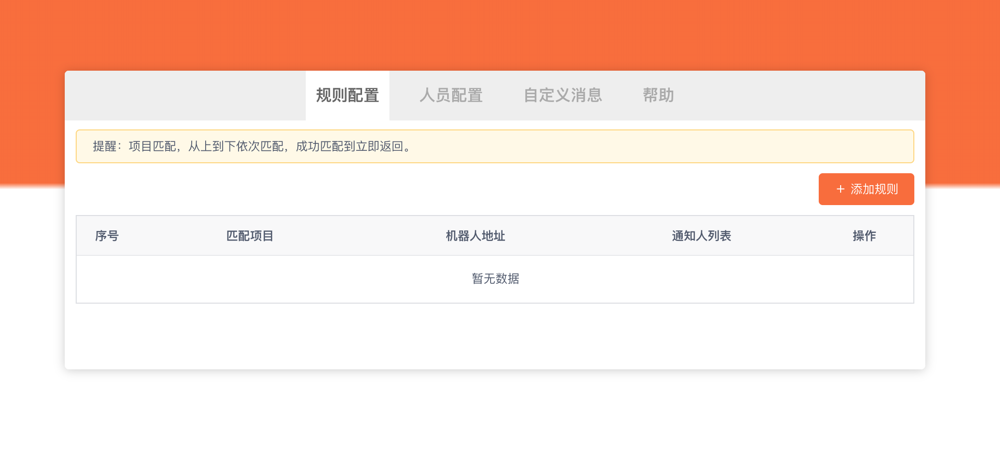

# GitLab 代码合并Chrome插件
## 功能列表
- [x] 支持直接复制MR消息
- [x] 支持自定义消息模板
- [x] 支持企业微信群机器人通知
- [x] 支持不同项目通知到不同的企业微信群
- [x] 支持@群成员

## 安装

下载[dist.crx](https://github.com/cyyjs/gitlab-merge-extensions/blob/master/dist.crx)，并拖放到Chrome浏览器扩展程序中。


## 插件配置

### 规则配置
可以对匹配的项目，指定微信机器人地址，及提醒的人员列表。
1. 点击添加规则
2. 输入匹配项目规则（会根据项目所在url来匹配）
3. 输入微信机器人地址（在企业微信群众创建机器人）
4. 选择提醒人员列表 (需要先添加人员配置)

### 人员配置
因为微信机器人@某人，需要指定手机号，需要通过此配置获取。

### 自定义消息
可以自定义消息的格式,默认格式：

```
项目: __project__
【__branch__】__issue__  __title__
__url__
```

|变量名|描述|
|---|---|
|`__project__`|项目名|
|`__branch__`|分支名称|
|`__issue__`|问题ID|
|`__title__`|标题|
|`__description__`|内容描述|
|`__url__`|MR地址|

## 使用
在Merge Request页面，会添加以下三个按钮


**复制MR消息** 将当前和MR消息复制到剪切板中  
**MR** 将消息发送到匹配的企业微信群中   
**Merged** 将合并完成消息发送到匹配的微信群中   
:::warning
复制的消息中，没有@xx 内容，因为复制的消息中提到的人员，并不会收到提醒。
:::